# BRE AI

**Satin Finserv Limited · Business Rules Engine + AI Underwriting**

BRE AI reads an applicant's real financial data, scores them with trained
machine-learning models, checks them against the lender's own approval rules,
and hands back one clear answer  approve, review, or reject  every time,
consistently.

---

## About the product

Every loan application raises the same question for the credit team:
**should we approve this, review it, or reject it and for how much?**
BRE AI is built to answer that question quickly and consistently, using the
applicant's own data rather than guesswork.

It's organised into four simple workspaces:

| Workspace | What it's for |
|---|---|
| **Data Sources** | Choose which feeds to underwrite on (bank statements, GST filings, UPI, property records, …) and set the rules for each. |
| **Model Hub** | Upload real borrower files; cleaning, training and testing the scoring models is automatic. Every version is kept. |
| **Model Testing** | Upload one applicant's file → instant credit score, risk band, and an approve / review / reject decision. |
| **Settings** | **Rule config**  pick a product, then turn its approval rules on or off per data source. **AI config**  choose the AI model that reads scanned documents. Plus a view of the security checks. |

---

## End-to-end workflow

```mermaid
flowchart LR
    A1[1 · Data Sources<br/>Pick feeds: AA bank statement, GST, BBPS, UPI ...]
    A2[Apply Data Source Rules<br/>data-quality checks per feed]
    A1 --> A2 --> B1

    B1[2 · Model Hub<br/>Upload a folder of borrower files]
    B2[Parse each file<br/>PDF vision LLM / CSV / XLSX / JSON / GST returns]
    B3[5-stage pipeline<br/>clean -> normalise -> engineer -> select -> score]
    B4[Train models · 3-fold CV<br/>versioned + SHA-256 signed]
    B5[Deploy a version]
    B1 --> B2 --> B3 --> B4 --> B5 --> C1

    C1[3 · Model Testing<br/>Upload one applicant's file]
    C2[Deployed models score it]
    C3[Credit score / risk band / loan eligibility]
    C4[Run BRE rules -> PASS / FAIL / SKIP]
    C5[Decision: APPROVE / REVIEW / REJECT]
    C6[Saved to Test History]
    C1 --> C2 --> C3 --> C4 --> C5 --> C6

    S0[4 · Settings — select product]
    S1[Enable / disable its rules<br/>per data source]
    S2[AI Setting vision LLM]
    S3[ML Security guardrails, poisoning<br/>drift, signed artifacts]
    S0 --> S1
    S1 -. user enables the rule set before testing .-> C1
    S2 -. configures parser .-> B2
    S3 -. guards uploads + training .-> B1
    S3 -. signs artifacts .-> B4
```

### Step by step

**1. Pick the data feeds and set their quality rules Data Sources**
- The team picks which of the 11 data feeds this loan product will be underwritten
  on bank statements, GST filings, utility-bill history, UPI activity, and so on.
- For each feed, the **Data Source Rules** are applied here checks on the
  incoming data itself (e.g. is the consent valid, are transactions duplicated,
  is the statement complete and recent enough). These are **data-quality gates**,
  not underwriting decisions, and they are applied **before training** they
  decide what data is trustworthy enough to teach the models with.

**2. Build the ML Model Hub**
- The team uploads a whole folder of real borrower files for the feed they picked
  in step 1 no single sample file, the actual data.
- Every file is read and cleaned up automatically, whatever format it's in:
  PDFs, spreadsheets, CSVs, JSON exports, even a photo or scan of a statement
  (an AI vision model reads those).
- That data is then refined in five simple steps:
  1. **Clean it up** remove noise and fill in gaps.
  2. **Standardise it** put every number on the same scale so nothing
     unfairly dominates.
  3. **Build useful signals** turn raw numbers into meaningful measures,
     like income stability or turnover trend.
  4. **Keep what matters** drop the signals that don't actually help.
  5. **Produce the final training set** ready to teach the models with.
- Then **picks an algorithm** to train with Gradient Boosting/ XGBoost/
  Random Forest a couple of others are available and starts training.
- The models are **trained** on that clean data, and their accuracy is measured
  honestly through cross-validation real testing, not a guess.
- Every time training runs, the result is saved as a **new version** older
  versions are never deleted, so the team can always step back to one that
  worked.
- Once a version is ready, the team **Upload** it that's what makes it the
  version Model Testing actually uses to score real applicants.

**3. Set the rules — Settings**
- **First pick the loan product** (LAP / SBL, Machine Loan, Vehicle Loan, MSME),
  **then turn its rules on or off** one data source at a time. This is a
  **second, separate rule book** the one that decides an applicant's outcome
  (e.g. minimum income, bounce count, GST filing regularity, credit-score
  threshold), configured per loan product and per data source.
- This is different from the Data Source Rules in step 1: those guard the
  *training data*; this one is applied to *each applicant* the next time someone
  tests one in Model Testing.
- Settings is also where the AI model that reads scanned statements is chosen,
  and where the security checks that guard the data and the models live.
- It's a one-time setup step, done **before** testing begins, and can be
  adjusted any time.

**4. Test an applicant — Model Testing**
- The user uploads one applicant's statement (ex.GST filing).
- The deployed model scores it instantly credit score, risk band, projected
  cash flow, and for GST, loan eligibility and filing-compliance too.
- The rule book configured in Settings is then run against that same applicant,
  showing exactly which checks passed, which failed, and why.
- All of that combines into one clear outcome: **Approve, Approve with Notes,
  Conditional Approval, or Reject.** A failure on a critical rule always forces a
  rejection, so the system never quietly overrides a hard stop.

**5. Nothing is lost**
- Every test that is run is saved to a history log and reflected on the dashboard,
  so the team can always look back at what was tested, when, and with what result.
